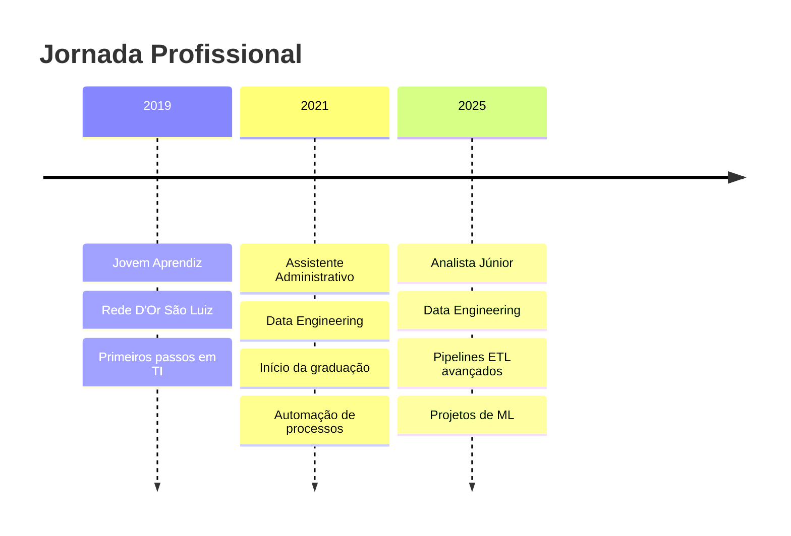

# Bruno Masello

<div align="center">


[](https://www.linkedin.com/in/bruno-masello)
[](https://brunomaselloport.netlify.app/)
[](mailto:bruno.d.masello@gmail.com)
[](https://wa.me/5521971256888)

</div>

## 👨‍💻 Sobre Mim

Olá! Sou um profissional de Ciência da Computação com especialização em **Engenharia de Dados** e **Desenvolvimento Full Stack**, apaixonado por tecnologia e resolução de problemas. Atualmente estou no último ano de Ciência da Computação na Universidade Estácio de Sá e acumulei mais de **5 anos de experiência profissional** em qualidade de dados, automação de processos e melhoria de sistemas na **Rede D'Or São Luiz**.

### 🎯 Objetivos Profissionais

- 🚀 Aplicar minha combinação de habilidades em manipulação de dados e desenvolvimento de software para criar soluções escaláveis e inovadoras
- 📈 Contribuir para organizações de tecnologia com foco em qualidade, eficiência e inovação
- 🌱 Expandir continuamente meus conhecimentos em tecnologias emergentes como Rust e Supabase
- 🤝 Colaborar em projetos que impactem positivamente usuários e organizações

## 🛠️ Stack Tecnológica

### 💻 Linguagens de Programação


### 🗄️ Banco de Dados


### 🚀 Frameworks & Bibliotecas


### 🔧 Ferramentas & Tecnologias


## 💼 Experiência Profissional

### 🏥 Rede D'Or São Luiz
**Analista Júnior - Data Engineering** | *Abril 2025 - Presente*
- 🔍 Validação, limpeza e padronização de grandes volumes de dados
- 💾 Desenvolvimento e otimização de consultas SQL em Oracle PL/SQL e SQL Server T-SQL
- 🔄 Implementação de pipelines ETL com SSIS para automação e integração de dados
- 📊 Elaboração de relatórios e dashboards para apresentação de insights

**Assistente Administrativo - Data Engineering** | *Março 2021 - Maio 2025*
- ✅ Garantia da consistência e confiabilidade dos dados em sistemas corporativos
- 🤖 Desenvolvimento e automação de processos internos
- 🛠️ Criação de soluções personalizadas para equipes internas
- 📈 Melhoria de 30% na precisão dos dados através de verificações automatizadas

## 🎓 Formação Acadêmica

**🎓 Bacharelado em Ciência da Computação**  
*Universidade Estácio de Sá* | 2021 - 2025

## 📜 Certificações

- ✅ **Análise e Solução de Problemas Complexos**
- ✅ **Programação para Internet**
- ✅ **Concepção de Algoritmos Eficientes, Estáveis e Escaláveis**
- ✅ **Banco de Dados Oracle 2022 Completo: SQL + PL/SQL + Modelagem**
- ✅ **Programação de Sistemas de Informação**

## 🚀 Projetos em Destaque

### 🐎 Sistema de Apostas em Corridas de Cavalos
**Tecnologias:** TypeScript, TensorFlow, Telegram API, Node.js

Um microsserviço complexo que:
- 📡 Consome dados via APIs externas
- 🧠 Processa informações através de modelos de Machine Learning
- 🤖 Distribui previsões via chatbot no Telegram
- 🔒 Utiliza TypeScript para tipagem segura

### 📊 Sistema de Monitoramento de Qualidade de Dados
**Tecnologias:** PL/SQL, T-SQL, SSIS

Solução que implementei na Rede D'Or para:
- 🔍 Detectar anomalias antes que se tornem problemas
- ⚡ Reduzir erros de dados em 30%
- 📈 Eliminar atrasos para equipes dependentes
- 🚨 Fornecer alertas proativos

### 🌐 Portal de Processamento Automatizado
**Tecnologias:** Node.js, Next.js, Full Stack

Portal desenvolvido para:
- 📋 Automatizar processamento de planilhas críticas
- ⚡ Reduzir tempo de processamento de horas para minutos
- 🔧 Permitir tratamento de erros em tempo real
- 💾 Armazenar resultados automaticamente no banco

## 📊 Estatísticas do GitHub

<div align="center">


</div>

## 🌟 Principais Competências

- 🔧 **Tecnologia da Informação**
- 📋 **Metodologias Agile**
- 🧪 **Teste de Unidade**
- 📊 **Engenharia de Dados**
- 🔄 **Processos ETL**
- 🤖 **Automação de Processos**
- 🧠 **Machine Learning**
- 🌐 **Desenvolvimento Full Stack**

## 📈 Objetivos de Aprendizado 2025

- [ ] Aprofundar conhecimentos em **Rust** para aplicações de alta performance
- [ ] Explorar **Supabase** para soluções modernas de backend
- [ ] Implementar práticas avançadas de **CI/CD**
- [ ] Contribuir para projetos **Open Source**
- [ ] Desenvolver expertise em **Microserviços**

---

<div align="center">

*"Comprometido com qualidade e eficiência, sempre buscando novos desafios que me permitam expandir meu conhecimento e contribuir significativamente para o sucesso de organizações de tecnologia."*


</div>

### 📈 Impacto Profissional

```
📊 Dados Processados: +1TB mensalmente
⚡ Redução de Erros: 30% em sistemas críticos
🚀 Automações Criadas: 15+ processos otimizados
👥 Equipes Impactadas: 5+ departamentos
⏱️ Tempo Economizado: 40+ horas/semana para equipes
```

## 📅 Linha do Tempo Profissional



## 🎯 Roadmap de Desenvolvimento

### 🔄 Em Andamento
- 🐎 **Sistema de Apostas ML** - Microsserviço com TensorFlow
- 📚 **Estudos em Rust** - Aplicações de alta performance
- 🌐 **Contribuições Open Source** - Projetos da comunidade

### 📋 Próximos Passos
- 🚀 **Certificação AWS** - Cloud Computing
- 🔧 **Kubernetes** - Orquestração de containers
- 📱 **React Native** - Desenvolvimento mobile
- 🧠 **Deep Learning** - Redes neurais avançadas

## 💡 Filosofia de Desenvolvimento

> *"Código limpo não é escrito seguindo um conjunto de regras. Você não se torna um artesão de software aprendendo uma lista do que fazer e não fazer. Profissionalismo e artesanato vêm de valores e disciplina."*
> 
> — Robert C. Martin

## 🌐 Presença Online

<div align="center">

| Plataforma | Link | Descrição |
|------------|------|-----------|
| 💼 LinkedIn | [bruno-masello](https://www.linkedin.com/in/bruno-masello) | Rede profissional e atualizações de carreira |
| 🌐 Portfolio | [brunomaselloport.netlify.app](https://brunomaselloport.netlify.app/) | Projetos e trabalhos desenvolvidos |
| 📧 Email | [bruno.d.masello@gmail.com](mailto:bruno.d.masello@gmail.com) | Contato profissional |
| 📱 WhatsApp | [+55 21 97125-6888](https://wa.me/5521971256888) | Contato direto |

</div>

## 🎉 Fun Facts

- 🎯 Comecei na área de TI como Jovem Aprendiz e cresci organicamente
- 🐎 Desenvolvo um sistema de ML para corridas de cavalos no tempo livre
- 🔧 Uso NeoVim como editor principal (sim, sou team Vim!)
- 📊 Já processei mais de 1TB de dados mensalmente
- 🚀 Automatizei processos que economizam 40+ horas/semana para equipes
- 🎓 Estou me formando em Ciência da Computação em 2025

---

<div align="center">

### 🚀 *"Transformando dados em insights, código em soluções, e desafios em oportunidades"*

**Obrigado por visitar meu perfil! 🙏**

</div>

