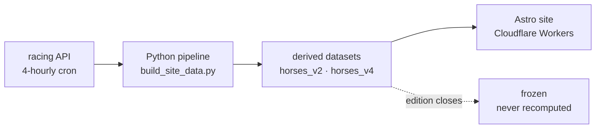

# Bruno Masello

**Backend and data engineering.** Rio de Janeiro, Brazil. Open to remote.

Six years of building things that publish numbers. Most of the work turns out to
sit around the figure rather than in it: where it came from, when it was true,
and what it does not cover. Two years of measuring my own ideas and watching
them fail is what taught me to put that first.

## What I am building

### [mazetick](https://github.com/bumasello/mazetick) · [mazetick.com](https://mazetick.com)

Time-stamped market data for UK and Irish horse racing: a record of what could
be known at each hour of the day, rather than a snapshot of what is known now.
Live since **13 September 2026**; **3,888 published URLs over 4,567 records** as
of 24 September 2026.

Racing Post and Sporting Life already publish the racecard and the form, free and
better than I would. What none of them publishes is *how any of it moved through
the day*: which each-way terms a bookmaker was advertising at 10:00 and again at
14:00, how wide the book was, whether the going changed after the 04:00
declaration. Those facts exist only if somebody records them continuously, and
once the day is over they cannot be recovered.

```mermaid
flowchart LR
  A["racing API<br/>4-hourly cron"] --> B["Python pipeline<br/>build_site_data.py"]
  B --> C["derived datasets<br/>horses_v2 · horses_v4"]
  C --> D["Astro site<br/>Cloudflare Workers"]
  C -.->|"edition closes"| E["frozen<br/>never recomputed"]
```

**A closed edition is frozen, never recomputed.** Recomputing the past with what
is known today is look-ahead bias, and it is the easiest way to publish a number
that is both wrong and flattering. The rest of the design follows from that rule:
versioned data contracts instead of mutating schemas, listings partitioned by
stable key instead of by position, a sitemap whose `lastmod` tells the truth even
when a lie would earn more crawl budget.

Runs on my own Linux server (Oracle Cloud, London). Astro, Cloudflare Workers,
Python, TypeScript.

### What it measured, and why all of it is negative

Five studies are published. Every one of them argues against something I wanted
to be true, and each carries its sample, its window, and the script and commit it
was derived from.

| Measured | Sample | Result |
|---|---|---|
| Backing the morning favourite | 33,508 races · Jan 2024 to Sep 2026 | Wins 32.8% of the time, returns **−3.90%** after commission |
| The place favourite at 1.5 or shorter | same window | Wins **78.8%** of its bets, still returns **−1.22%** |
| Ten classic handicapping rules | 179,990 runners · 662,000 results | All ten already in the price, to within **0.5pp** |
| Tote against the exchange | 343 matched races | Pool paid **0.94 / 0.85 / 0.81** of the exchange. No odds band favoured it |
| Cost of crossing the spread | 212,373 quotes · 26 days | **3.53%** of the price |

A site that tells you a bet winning 78.8% of the time still loses money has no
reason to flatter the next number it shows you. I spent two years trying to beat
these markets, first with machine learning and then with classic handicapping
rules, measured it honestly, and neither worked. Those failures are published
with their sample sizes rather than buried.

**The spread figure was wrong the first time, and that correction is published
too.** I measured it at 4.35%, wrote down in advance that I would abandon the
strategy if execution cost exceeded 80% of the gross signal, and abandoned it.
Then I found the bug: one line of the filter read the *year* out of a URL instead
of the course, so a third of the quotes were not British or Irish racing at all.
The real figure is 3.53%. The net-return scenarios derived from the bad curve
were **withdrawn rather than corrected**, because a number that inherited
contamination does not get to stay up with a footnote.

Nothing is published until an agent that does not know the expected answer
reproduces it from the raw data. It gets the question and a path, nothing else,
so it cannot see the answer I was hoping for. That check has caught **four**
inflated or look-ahead-contaminated conclusions so far.

## Other things I have shipped

**[sueca](https://github.com/bumasello/sueca)** is real-time multiplayer Sueca,
the Portuguese card game. Axum and MongoDB Atlas on the backend, Yew and
WebAssembly on the front, the ruleset in a crate both sides share. Auth, lobby
with automatic matchmaking, the full rules. Deployed.

I learned Rust by finishing this, not by reading about it. The choice of project
was deliberate: shared state between simultaneous players is exactly where Rust
stops being polite, so ownership and borrowing stopped being chapters I had read
and became problems I had to solve for the thing to work.

In **[py_rpg_mestre_ia](https://github.com/bumasello/py_rpg_mestre_ia)** a
generative model (Gemini, via function calling) runs as game master for tabletop
RPG systems, narrating and holding the mechanics for several concurrent players
over WebSocket. FastAPI, Supabase. Functional prototype.

**[horsing-maze](https://github.com/bumasello/horsing-maze)** is TypeScript
betting automation, active since April 2025. It is the research codebase
mazetick's data layer grew out of, kept separate on purpose: no key, no secret
and no database access belongs in the public site repo.

**[email_classifier](https://github.com/bumasello/email_classifier)** is a Python
API that classifies email and drafts replies,
[deployed on Vercel](https://email-classifier-sigma.vercel.app).

**[dotfiles](https://github.com/bumasello/dotfiles)** holds my NeoVim and shell
config, maintained since December 2023. Still my editor.

## Day job

**Rede D'Or São Luiz**, Rio de Janeiro. There since August 2019, currently Junior
Analyst in Data Engineering and Backend Development.

- RESTful APIs in Node.js and Express for corporate systems integration
- ETL pipelines in SSIS; automation written in JavaScript and TypeScript
- Query optimisation in Oracle PL/SQL and SQL Server T-SQL at production volume
- Microservices for real-time data validation, cleansing and standardisation
- Deep learning models integrated into automated data-processing workflows
- Conceived and built a desktop application to give a non-technical internal team
  operational autonomy over recurring database work, cutting their dependency on
  technical tickets. Functional, paused before rollout when management changed.

B.Sc. Computer Science, Universidade Estácio de Sá, completed January 2026.

## Stack, with the depth stated

| | Professional | Personal projects |
|---|---|---|
| **Backend** | Node.js, Express, NestJS, REST, microservices | Axum (Rust), FastAPI (Python) |
| **Data** | ETL (SSIS), Oracle PL/SQL, T-SQL, data quality and governance | Python pipelines, PostgreSQL, Supabase |
| **Frontend** | React, Next.js, Electron | Yew (Rust/WASM), Astro, Tailwind |
| **Databases** | Oracle, SQL Server, MongoDB | MongoDB Atlas, PostgreSQL, Supabase |
| **Infra** | Docker, Git | Cloudflare Workers, Oracle Cloud, Netlify, Vercel, Ubuntu Server homelab |

Linux is real but not a specialism: Arch as a daily driver for a stretch, Ubuntu
now, a homelab on Ubuntu Server, and the cloud box that runs the mazetick
pipeline.

Portuguese native, English fluent and professional, Spanish basic.

### What I have not done

Same rule as the numbers above. Saying this costs less than being found out.

- **No professional code review.** My employer does not practise it as a
  methodology, so structured review is something I want from a next role, not
  something I have had.
- **No professional automated testing.** Unit tests in study and personal
  projects only.
- **CI/CD in personal projects only.** GitHub Actions, never in a professional
  pipeline. No Jenkins at all.
- **Never configured an MCP server.** My agent-to-tool experience is Gemini
  function calling, which is the same idea under a different protocol.
- **No n8n, Zapier, Make** or any visual workflow builder. I automate the same
  class of problem by writing the integration.
- **No C# or Unity yet.** Studying C#, and the reason is Unity rather than any
  job posting, which is why the study survives the posting.
- English is fluent, but I do not work in it day to day, because Rede D'Or runs
  in Portuguese.

## Contact

[bruno.d.masello@gmail.com](mailto:bruno.d.masello@gmail.com) ·
[LinkedIn](https://www.linkedin.com/in/bruno-masello) ·
[Portfolio](https://brunomaselloport.netlify.app/)

31 public repositories here, first push June 2022. Every racing figure above
names the script and the commit it was derived from, on
[mazetick.com](https://mazetick.com).
